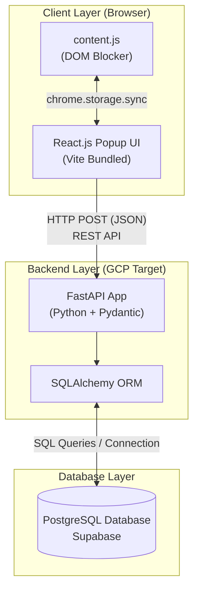

```mermaid
  graph TD
      %% User Interface Layer
      subgraph Client ["Client Layer (Browser)"]
          UI["React.js Popup UI<br/>(Vite Bundled)"]
          CS["content.js<br/>(DOM Blocker)"]
      end
  
      %% Storage & REST API Communication
      CS <-->|"chrome.storage.sync"| UI
      UI -->|"HTTP POST (JSON)<br/>REST API"| API
  
      %% Application Layer
      subgraph Backend ["Backend Layer (GCP Target)"]
          API["FastAPI App<br/>(Python + Pydantic)"]
          ORM["SQLAlchemy ORM"]
          API --> ORM
      end
  
      %% Database Layer
      subgraph Data ["Database Layer"]
          DB[(PostgreSQL Database<br/>Supabase)]
          ORM <-->|"SQL Queries / Connection"| DB
      end
  
      %% Custom Styling
      classDef client fill:#1e1e1e,stroke:#ff3e3e,stroke-width:2px,color:#fff;
      classDef backend fill:#1e1e1e,stroke:#00aaff,stroke-width:2px,color:#fff;
      classDef data fill:#1e1e1e,stroke:#00e676,stroke-width:2px,color:#fff;
```

    class UI,CS client;
    class API,ORM backend;
    class DB data;
